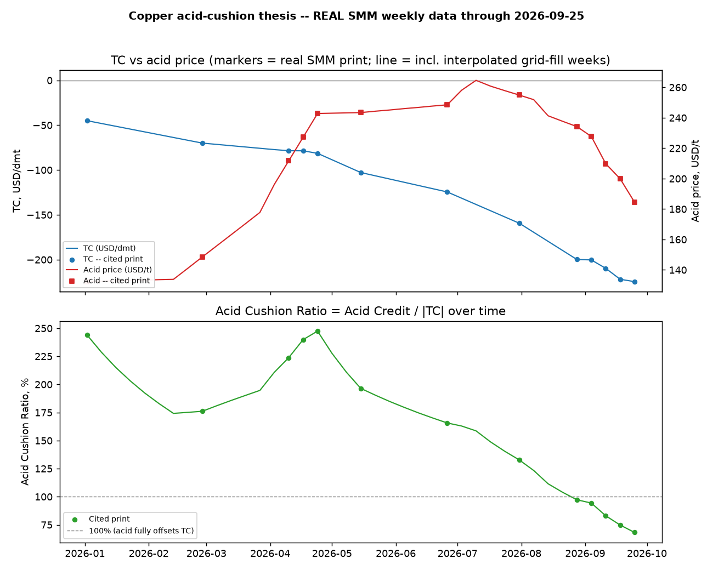
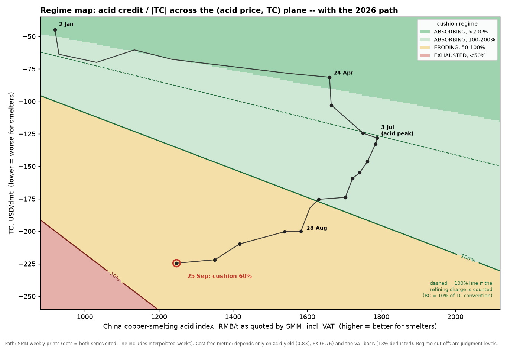

# Copper's Hidden Margin — the acid cushion in copper-smelter economics

A market-structure case study: **when does the sulphuric-acid by-product market stop cushioning negative treatment charges, and where should that show up first?**

Built on public weekly SMM data (copper TC, China acid, regional acid benchmarks), Ivanhoe's Kamoa-Kakula disclosures and a small, transparent smelter model. Companion to the article *"Copper's Hidden Margin: When the Acid Cushion Starts Shrinking"* (Olena Vasiuta, 7 Sep 2026).

**Read first: [`STRATEGY_NOTE.md`](STRATEGY_NOTE.md)** — the 9-section note (thesis, transmission, signal, counterfactual, regime map, market expression, falsification, monitoring).

## The result in four lines

- Acid credit / \|TC\| for a representative Chinese custom smelter fell from **152% (3 Jul) to 60% (24 Sep)**, with TC at a record -$224.53/dmt and China's acid index down 12 weeks running.
- The fall was **TC-led** from April (79% TC / 21% acid) and became **acid-led** only in the last four weeks (67% acid / 33% TC).
- It is a **regional divergence, not a global shrinking cushion**: ex-China acid (EXW DRC ~$935/t) is ~4.6x China-domestic ex-VAT, and Kamoa-Kakula's coverage is indicated to *widen* in Q3. Kamoa's Q1→Q2 dip is not an acid-price effect (realised price flat at $467 → $465/t; Q1 opex was partly capitalised).
- The **level** of the cushion is definition-sensitive (36%–73% across acid yield, refining-charge and VAT basis); the **direction** is not.

| | |
|---|---|
|  |  |

## Run it

```bash
pip install -r requirements.txt
python acid_cushion_monitor.py     # runs everything; writes charts to output/ and tables to output/tables/
```

Optional self-checks: `python copper_acid_data.py && python margin_model.py && python strategy_layer.py`

Every script can be launched from any directory (it switches to the repo root itself), so the Run button in an IDE works too.

SMM weekly prints have no free API: each point in `copper_acid_data.py` was transcribed by hand from a named SMM article and carries a provenance tag and note. Copper/silver prices are in `data/metal_prices.csv` (refresh script: `extras/fetch_metal_prices_yfinance.py`).

## What is in the folder

| Path | What it is |
|---|---|
| `STRATEGY_NOTE.md` | **The note. Read this.** |
| `output/` | The 5 charts. `output/tables/` has the CSVs behind the numbers. |
| `acid_cushion_monitor.py` | **The only script you need to run.** |
| `copper_acid_data.py` | All real data, each point tagged `cited` / `cited-approx` / `interpolated`. |
| `strategy_layer.py`, `strategy_charts.py` | The analysis (attribution, counterfactual, regime map, falsification) and its charts. |
| `margin_model.py`, `model_a.py`, `model_b.py`, `model_c.py`, `thesis_dashboard.py`, `thesis_monitor.py`, `data_loaders.py`, `smelter_calibration.py` | Supporting model code used by the monitor. |
| `data/` | Input data files. |
| `docs/METHODOLOGY.md` | Technical detail: inputs, data inventory, limitations. |
| `extras/` | **Optional, not part of the analysis:** the original zinc-vs-copper experiment (`extras/real_data_check.py`, `extras/demo.py` — which writes its synthetic-data outputs to `extras/synthetic_demo/` when run) and data-download scripts. |

## What this is not

Not a trading strategy: no backtest, Sharpe or signal anywhere. Not a forecast of acid, TC or copper prices. Not any real smelter's P&L — the model uses benchmark index levels for a representative custom smelter with uncalibrated cost inputs; the absolute margin level should not be quoted. Regime cut-offs and falsification thresholds are declared judgment levels, not fitted.

## Honest data status (4 Oct 2026)

16 of 39 weekly grid points have both series as cited prints; every headline statistic uses cited endpoints only. EXW DRC/Zambia has not printed since 4 Sep and the sulphur series is stale since 31 Jul — both are flagged wherever used. SMM has since published a week-ending-30-Sep print (TC -231.68) that is **not yet included** — all numbers here run through the 24 Sep prints. Kamoa's Q3 figures are a management indication, not a reported result. Details: [`docs/METHODOLOGY.md`](docs/METHODOLOGY.md).