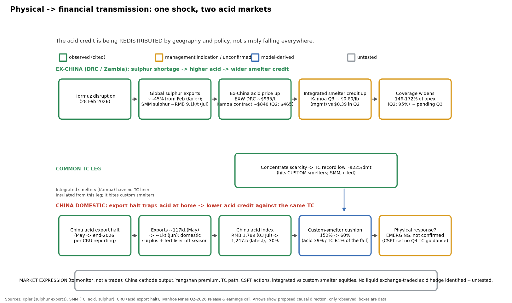
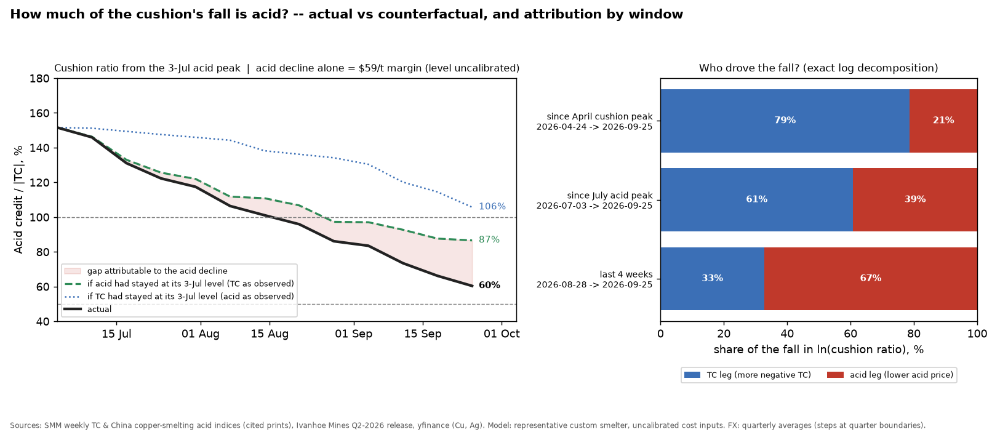
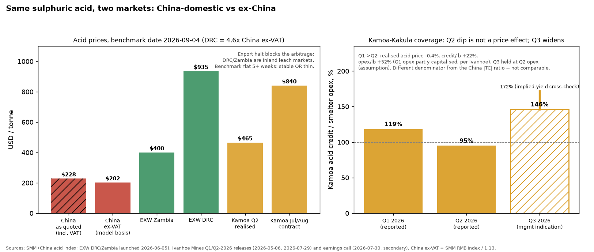

# Copper's Hidden Margin — when does acid become a binding constraint on smelter economics?

*Strategy note · data through the SMM prints of 24 Sep 2026 (grid date 25 Sep) · prepared 1 Oct 2026 · companion to the article "Copper's Hidden Margin: When the Acid Cushion Starts Shrinking" (7 Sep 2026)*

Reproduce every number and chart here with `python acid_cushion_monitor.py`. Method, data inventory and limitations: [`docs/METHODOLOGY.md`](docs/METHODOLOGY.md). Nothing here is a price forecast or a trade recommendation.

---

## 01 · Executive thesis

**Question.** When does the sulphuric-acid by-product market stop being a cushion and start being a binding constraint on copper-smelter economics — and where in the market should that become visible first?

**Finding.** The cushion is not shrinking everywhere; it is being **redistributed by geography and policy**.

| | Evidence (all cited unless marked) |
|---|---|
| **China-domestic custom smelters are losing their cushion.** | Acid credit / \|TC\| fell from 219% (24 Apr) and 152% (3 Jul) to **60%** (24 Sep). It dropped below 100% on 21 Aug on the headline (ex-VAT) basis — anywhere from 26 Jun to 28 Aug depending on how RC and VAT are treated. TC is at a record **-$224.53/dmt**; the China acid index has fallen 12 weeks running to RMB 1,247.5/t (-30% from its 3 Jul peak). |
| **Ex-China integrated producers are gaining one.** | EXW DRC acid ~$935/t and Zambia ~$400/t vs ~$202/t China-domestic ex-VAT on the same date (DRC ≈ 4.6x China). Kamoa-Kakula's acid price rose from $465/t (Q2 realised) to ~$840/t (Jul/Aug contracts); management indicates the acid credit rises from $0.39/lb to ~$0.60/lb in Q3 (earnings-call summary, not a reported result). |
| **The driver changed during the summer.** | The cushion's fall since April is **79% TC / 21% acid**. Over the last four weeks it is **67% acid / 33% TC**. The article's claim that the acid offset is now "actively widening its own decline" holds — but only for the last month. |
| **It is not yet a confirmed physical constraint.** | SMM reports production-cut *intentions emerging* (18 Sep) and CSPT set no Q4 TC guidance (24 Sep). No named smelter has announced a dated curtailment attributed to acid. |

---

## 02 · Physical → financial transmission

The causal chain is **not one line**. The Hormuz-linked sulphur shortage that lifts ex-China acid (DRC/Zambia) coexists with a China-specific acid export halt that *traps* acid at home and pushes the domestic price down — while sulphur itself rebounded in China (SMM, early Sep). A single "acid is falling" story misses that these are opposite-signed transmissions.

The strategy question is therefore not *whether acid prices are falling* but **whether the resulting divergence in smelter economics becomes large enough to change physical behaviour and relative values**.

---

## 03 · The signal

**Acid cushion = acid credit ÷ |TC|** for a representative custom smelter (acid yield 0.83 t/t concentrate). The acid credit is **ex-VAT**: SMM quotes the RMB acid index including 13% VAT (its own price pages: the original RMB price includes VAT, the USD series deducts it), and VAT is not smelter revenue.

| 24 Apr | 3 Jul | 28 Aug | 24 Sep |
|---:|---:|---:|---:|
| 219% | 152% | 86% | **60%** |

Regime bands (≥100% absorbing · 50–100% eroding · <50% exhausted) are judgment levels, not calibrated. Markers are cited prints; the thin line includes interpolated weeks (23 of 39 grid weeks still lack a cited print for at least one series — see methodology).

**How fragile is the level?** The *direction* survives every definition tried; the *level* does not. Two choices move it a lot: whether the refining charge (RC, at SMM's 10%-of-TC convention) is counted, and whether the VAT is deducted. Latest reading (yield 0.83):

| Latest cushion | VAT deducted (**headline**) | as quoted (VAT included) |
|---|---:|---:|
| TC only | **60%** | 68% |
| TC + RC | 39% | 44% |

Across acid yields of 0.765–0.8925 the full range is 36%–73%. The date the cushion drops below 100% for good moves from 28 Aug (TC only, as quoted) through 21 Aug (headline) and 17 Jul (TC + RC, as quoted) to 26 Jun (TC + RC, ex-VAT). The RC is a convention rather than an observed series, so it stays a sensitivity; **ignoring it probably still overstates the cushion.** The VAT deduction rests on SMM's own convention, applied to the national index by inference (that index's RMB page was not retrieved).

---

## 04 · Counterfactual: how much is acid?

| Window (both ends cited prints) | Cushion | Acid share of the fall | TC share |
|---|---|---:|---:|
| 24 Apr → 24 Sep | 219% → 60% | 21% | **79%** |
| 3 Jul → 24 Sep | 152% → 60% | 39% | **61%** |
| 28 Aug → 24 Sep | 86% → 60% | **67%** | 33% |

*Exact log decomposition: ln(ratio) = ln(acid price) − ln(\|TC\|), so the two legs sum to the total with no residual (and a constant like the VAT factor drops out, so these shares do not depend on the VAT choice).* TC kept widening, but more slowly: -$40.5/dmt in the four weeks to 28 Aug, -$24.7 in the four weeks to 25 Sep — consistent with the article's "TC may be slowing" point.

**Counterfactual — acid held at its 3 Jul level (in RMB), TC as observed:** the cushion would be **87%, not 60%**, and the model's treatment margin **$59/t of concentrate better** (a change, not a level). Holding TC at its 3 Jul level instead gives 106%. Since July, TC has cost more ($96/t) than acid ($59/t) — but TC hits every smelter alike, while acid is where smelters differ.

*The model reports only changes in margin, not its absolute level: the level depends on cost assumptions (conversion cost, energy, premium) that are not data. Changes over a window are independent of those constants.*

---

## 05 · Regime map

For any (acid price, TC) pair the colour is the cushion regime; the 2026 path is overlaid. The path moved right (acid up) with TC drifting lower until early July, then **down-and-left**, crossing the 100% line on 21 Aug. The frontier is cost-free — it depends only on acid yield, FX and the VAT deduction. At today's TC of -$224.53 the cushion is 100% only if the SMM China acid index (as quoted) is above **RMB ~2,066/t** — above the 3 Jul peak of 1,789. The dashed line shows where the 100% frontier moves if RC is counted.

Reading it as regimes rather than a number: with the index back at RMB 1,789 (its peak) the cushion is 100% only if TC is no worse than about -$194/dmt (a ~$30 recovery from today); at RMB 1,600, about -$174 (a ~$51 recovery).

---

## 06 · Market expression

*If the thesis is right, where should the divergence become observable?* These are **observables to monitor, not instruments**: no exchange-traded acid hedge was identified in this project, and none of the relationships below is backtested.

| # | Expression | Status now |
|---|---|---|
| A | **China-domestic vs ex-China acid spread** (EXW DRC/Zambia vs SMM China index). The relevant spread is *China vs ex-China*, not DRC vs Zambia: the export halt (in force through end-2026, per CRU reporting) blocks the arbitrage, so the spread can persist. | DRC ≈ 4.6x China ex-VAT (as of 4 Sep). Regional benchmark launched 5 Jun and flat 5+ weeks: stable **or** thin — not distinguishable. |
| B | **Acid ÷ \|TC\|** through time | 60%, ERODING |
| C | **Integrated vs custom smelter** — Kamoa-Kakula (integrated, ex-China) vs the China custom-smelter benchmark | see below |
| D | **Copper vs zinc treatment economics** — cross-market validation only | Zinc spot TC -$113/dmt (all-time low) vs $85 benchmark, smelters leaning on silver/acid credits (Reuters, via the article). Not modelled on real data here. |
| E | **Physical downstream**: China cathode output, CSPT guidance, Yangshan premium | Cathode output fell more than expected in July (SMM) — not cleanly attributable to acid vs concentrate scarcity. |

**Company validation — Kamoa-Kakula (Ivanhoe Mines).** Acid credit ÷ smelter opex per lb of copper: **118.5% (Q1) → 95.1% (Q2)**. This dip carries no information about the acid price: Ivanhoe's own releases show the realised acid price was flat ($467/t in Q1, $465/t in Q2 — "unchanged quarter-on-quarter"); the acid credit per lb *rose* 22% ($0.32 → $0.39, more acid sold per lb of copper produced); and smelter opex per lb rose 52% ($0.27 → $0.41) because, per the Q2 release, **Q1 opex was understated by the partial capitalisation of smelter operating costs** — an accounting effect (utilisation was ~60% in both quarters). Q1's 118.5% was flattered; Q2's 95% is the cleaner level. Looking forward, July/August contracts are ~$840/t (+80%); management indicates a Q3 credit of ~$0.60/lb (earnings-call summary — not in the release), i.e. **~146%** of Q2 opex (**172%** on an implied-yield cross-check at $840/t; opex held at the Q2 level). Earlier versions of this project (and, implicitly, the article's use of Kamoa) read the Q1→Q2 dip as early evidence of a shrinking cushion; that reading is withdrawn. Kamoa is evidence of the **ex-China side** of the divergence. Its ~$840/t contract still sits below the DRC benchmark (~$935/t) despite integration — "integration = pricing edge" remains a hypothesis. Its ratio uses a different denominator (total smelter opex) from the China \|TC\| ratio; the two are not comparable number-for-number.

---

## 07 · What would make me change my mind

Declared on 1 Oct 2026, before the next data. Thresholds marked *judgment* are not calibrated.

| ID | Condition | Direction | Status (1 Oct) |
|---|---|---|---|
| C1 | Cushion ratio rises on two consecutive weekly prints (erosion stops) | weakens | not triggered (-7.3pp, -5.8pp) |
| C2 | TC recovers ≥ $25/dmt from its record low (*judgment*, ≈ the $20–28 index-minus discounts SMM cites) | weakens | not triggered (0.00) |
| C3 | Cushion < 50% for 4 weeks with **no** documented curtailment → acid is not binding in practice; the physical leg fails | tests physical leg | not yet in scope (60%) |
| C4 | EXW DRC/Zambia fall toward China-domestic levels (divergence closes) | weakens | **not testable** — no print since 4 Sep |
| C5 | Kamoa Q3 (late Oct/Nov): coverage > 100% and realised acid ≫ $465/t confirms the ex-China side; < 100% contradicts it | either | pending |
| C6 | China relaxes the acid export halt and exports resume | weakens | manual (policy) |
| C7 | Sulphur-burner curtailments / fertiliser restocking lift China acid despite the halt | weakens | **not testable** — sulphur series stale since 31 Jul |

**Strengthens if:** acid keeps falling while TC stays near its floor; the China–ex-China spread persists; Kamoa's Q3 coverage clears 100%; a smelter announces a dated cut citing acid placement.

**One alternative the data cannot yet rule out:** output cuts that look like an acid effect may simply be concentrate scarcity (the TC leg). C3 is the test that separates them.

---

## 08 · Monitoring framework

| Indicator | Frequency | Latest | Next action |
|---|---|---|---|
| 1. TC (SMM Imported Copper Concentrate Index) | weekly | -$224.53 (24 Sep) | add each print to `copper_acid_data.py` |
| 2. China acid (SMM copper-smelting acid index) | weekly | RMB 1,247.5 (24 Sep) | same |
| 3. EXW DRC / Zambia acid | weekly (when it prints) | $935 / $400 (4 Sep) | **stale — refresh before relying on expression A** |
| 4. Sulphur (SMM EXW Shandong) | weekly | RMB 9,103.5 (31 Jul) | **stale — refresh before relying on C7** |
| 5. Export / fertiliser policy | event | acid halt through end-2026 (CRU); fertiliser-window question unresolved | manual |

**Primary sources I re-opened** (full list of every point, with notes, is in `copper_acid_data.py`):

| Print | Source |
|---|---|
| TC -128.25 (3 Jul) | [SMM Copper Concentrates Spot Weekly Review, 3 Jul](https://news.metal.com/en/newscontent/103987313-mid-year-long-term-contract-pricing-scheme-settled-index-linked-model-breaks-new-ground-smm-copper-concentrates-spot-wee) |
| TC -132.84 (10 Jul) | [SMM weekly review, 10 Jul](https://news.metal.com/newscontent/103999281-las-tc-spot-caen-por-debajo-de-la-marca-de--130-y-la-brecha-entre-los-niveles-de-precios-psicológicos-de-las-fundiciones) |
| TC -146.15 (17 Jul) | [SMM weekly review, 17 Jul](https://news.metal.com/en/newscontent/104011502-spot-transactions-of-imported-copper-concentrates-increase-tcs-continue-to-deteriorate-smm-copper-concentrate-spot-weekl) |
| TC -159.37 (31 Jul) | [SMM weekly review, 31 Jul](https://news.metal.com/en/newscontent/104036547-cobre-panama-mine-restart-accelerates-imported-copper-concentrate-spot-tcs-continue-to-deteriorate-smm-copper-concentrat) |
| Acid RMB 1,789 (3 Jul, peak) | [SMM Sulphuric Acid Weekly Review, 3 Jul](https://news.metal.com/en/newscontent/103987041-chinas-sulphuric-acid-market-regional-divergence-intensifies-index-continues-to-strengthen-smm-sulphuric-acid-weekly-rev) |
| Acid RMB 1,784.5 (10 Jul) | [SMM Sulphuric Acid Weekly Review, 10 Jul](https://news.metal.com/newscontent/103998631-중국-황산-시장이-고점에-머물며-지역-간-격차가-심화되고-있다-smm-sulfuric-acid-weekly-review) |
| TC -200.31 / acid RMB 1,539.5 (4 Sep) | the two SMM reviews in the source article's reference list (in `copper_acid_data.py`) |
| TC -221.89 (18 Sep) | [SMM Copper Concentrate Spot Weekly Review, 18 Sep](https://news.metal.com/newscontent/104123127-imported-copper-concentrate-tcs-continue-to-fall-with-some-smelters-beginning-to-show-willingness-to-cut-production-smm-copper-concentrate-spot-weekly-review) |
| TC -224.53 (24 Sep) | [SMM Copper Concentrate Spot Weekly Review, 24 Sep](https://news.metal.com/newscontent/104133941-cspt-meeting-decides-not-to-set-q4-copper-concentrate-tc-guidance-price-imported-copper-concentrate-trading-activity-declines-smm-copper-concentrate-spot-weekly-review) |
| Acid RMB 1,351 (18 Sep) | [SMM Sulphuric Acid Weekly Review, 18 Sep](https://news.metal.com/newscontent/104122023-chinas-sulphuric-acid-weekly-decline-narrowed-significantly-with-shanxi-falling-by-a-further-330-yuanmt-smm-sulphuric-acid-weekly-review) |
| Acid RMB 1,247.5 (24 Sep, 12th weekly decline) | [SMM Sulphuric Acid Weekly Review, 24 Sep](https://news.metal.com/newscontent/104133833-waiting-for-policies-and-winter-stockpiling-the-sub-thousand-wave-spreads-to-central-china-smm-sulphuric-acid-weekly-review) |
| Kamoa Q2 | [Ivanhoe Mines Q2 2026 results, 29 Jul](https://www.ivanhoemines.com/wp-content/uploads/20260729-IVN-Q2-Financial-Results-ABF.pdf) |

Every print has its source article title and date in `copper_acid_data.py`; the links are in the same notes. A few have no link (TC 2 Jan, 27 Feb, 13 Mar; acid 24 and 31 Jul) because the page could not be retrieved. The prints for 11, 18 and 24 Sep were checked against the SMM reviews and match.

---

## 09 · Method and code

All technical detail is in [`docs/METHODOLOGY.md`](docs/METHODOLOGY.md): provenance (cited / cited-approx / interpolated) for every weekly point, model inputs and which are uncalibrated, the full limitations list, and a code map.

*Version note (1 Oct 2026).* This supersedes the 26 Sep version. Changes: attribution, counterfactual, regime map and falsification block added; the Kamoa Q1→Q2 reading corrected (see §06); one S&P Platts print removed from the SMM TC series and seven interpolated weeks replaced with SMM prints; the acid peak re-dated to 3 Jul; the monitor chart's provenance markers fixed.

**Limitations that matter most for a reader:** (i) it is a benchmark-index model of a *representative* smelter, not any real smelter's P&L; (ii) no absolute margin level is reported — cost inputs are assumptions, and the precious-metal credit is token; (iii) 23 of 39 weekly grid points still contain an interpolated value — every headline statistic above uses cited endpoints only; (iv) the RC treatment and the inferred VAT basis change the cushion level materially; (v) Kamoa's Q3 figures are a management indication from a secondary summary of the earnings call, not a reported result; (vi) one company and one benchmark index cannot prove a market-wide mechanism.
